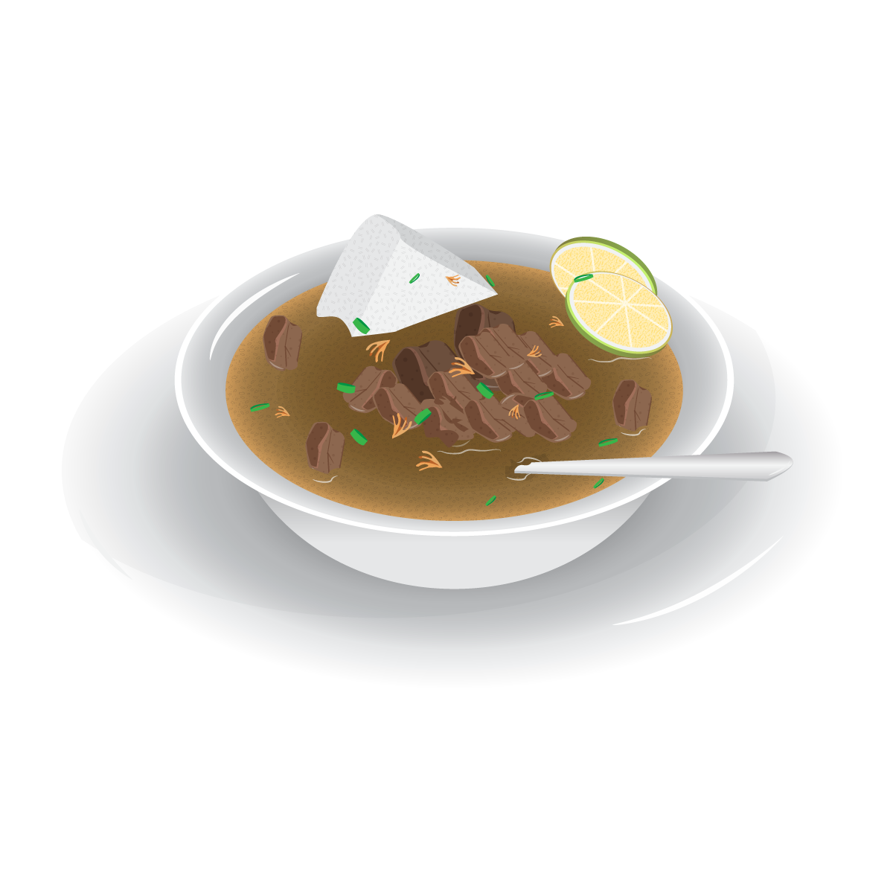
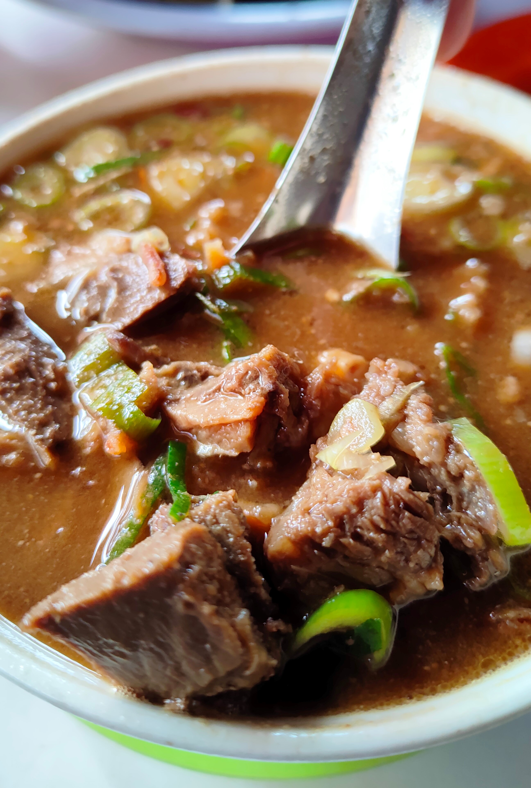

# Halip's Food

## Description

Hi, welcome to Halip's Food! This is a website showcasing delicious food from Makassar, the capital city of South Sulawesi. The unique flavors and rich spices of Makassar's cuisine reflect the local culture and traditions.

## Navigation

- [Beranda](#home)
- [Menu](#menu)
- [Testimoni](#testimonial)

## Home

### Semua tentang makanan lezat di Makassar

Makassar, ibu kota Provinsi Sulawesi Selatan, merupakan tempat yang kaya akan kuliner khas. Dengan perpaduan cita rasa lezat dan bumbu yang kaya, makanan khas Makassar secara unik mencerminkan budaya dan tradisi masyarakat setempat.

## About Us

Halip's Food menghadirkan kelezatan makanan khas Makassar dalam setiap suapan. Kami berkomitmen untuk menyajikan bahan-bahan segar dan musiman yang menggoda selera. Rasakan kekayaan cita rasa yang autentik dan temukan harmoni sempurna antara masakan tradisional dan inovatif. Mulailah petualangan kuliner Anda di Halip's Food dan nikmati pengalaman kuliner yang tak terlupakan.

## Menu

Nikmati kelezatan kuliner khas Makassar yang kaya akan rasa dan aroma. Jangan lupa untuk mencicipi berbagai hidangan yang sudah menjadi ikon kuliner dari daerah ini. Selamat mencoba!

## Testimonial

Bersama dengan makanan kami yang berkualitas tinggi, kami juga menawarkan suasana yang nyaman dan pelayanan yang ramah. Jadikan Halip's Food tujuan kuliner Anda dan rasakan kelezatan Makassar yang tak dapat dilupakan.

- Halipuddin
  - The Owner of Halip's Food
  - Makassar, Indonesia
  - "Rasakan kekayaan cita rasa yang autentik dan temukan harmoni sempurna antara masakan tradisional dan inovatif. Dengan dedikasi kami dalam menyajikan makanan Makassar yang istimewa, kami membawa Anda pada perjalanan kuliner yang menggabungkan kekayaan budaya dan kreativitas"
  - 2023

## Contact

- Phone: +6285-396-358-995
- Email: <halipuddin.angko@gmail.com>, <halipuddin.hambali@brightchamps.com>

## Footer

- Service
  - Membership
  - Products
  - Stories
  - Menues

- Company
  - Quality
  - Help
  - Share
  - Careers

- Terms
  - Terms & Conditions
  - Privacy Policy
  - Membership
  - Disclaimer

- [Halip's Food](https://halips-food.vercel.app/)

© `` Halip's Food
